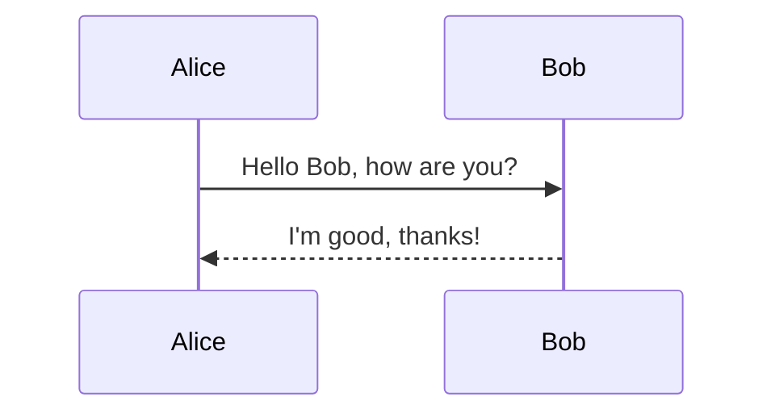
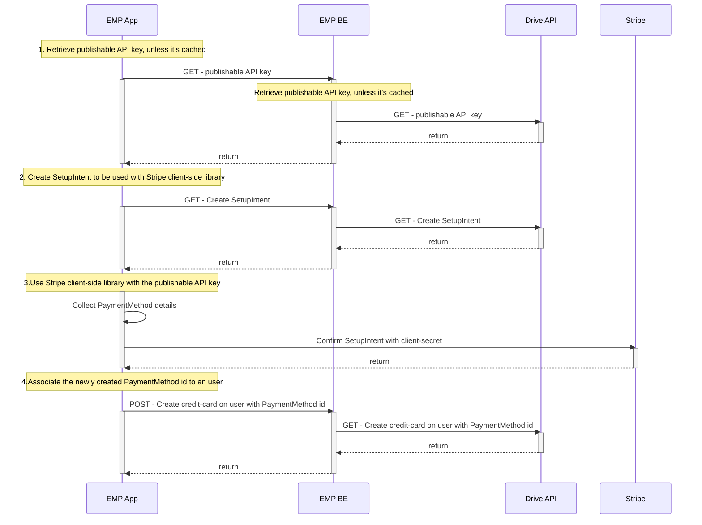

Hello

This is a test string to be edited!

<a href="https://readme.com" target="_blank">ReadMe</a>

 

<Custom />

 

<HTMLBlock>{`

`}</HTMLBlock>

# TEST

 

Another sentence appear!

 

 

This is inside a component