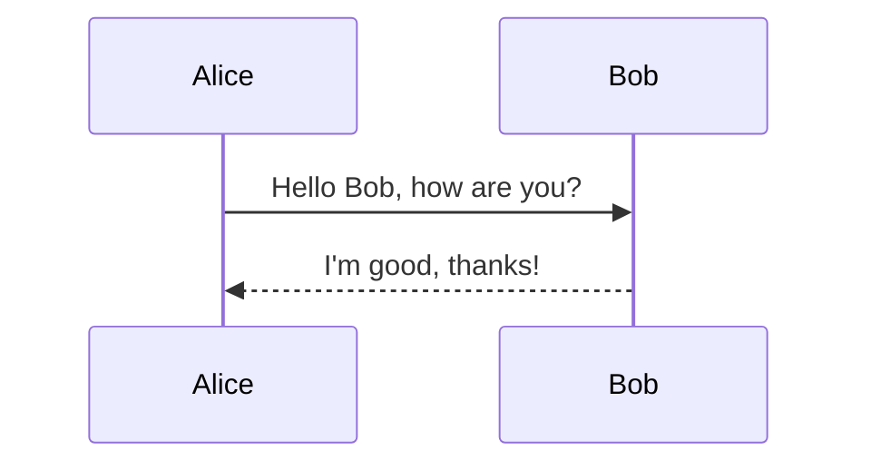
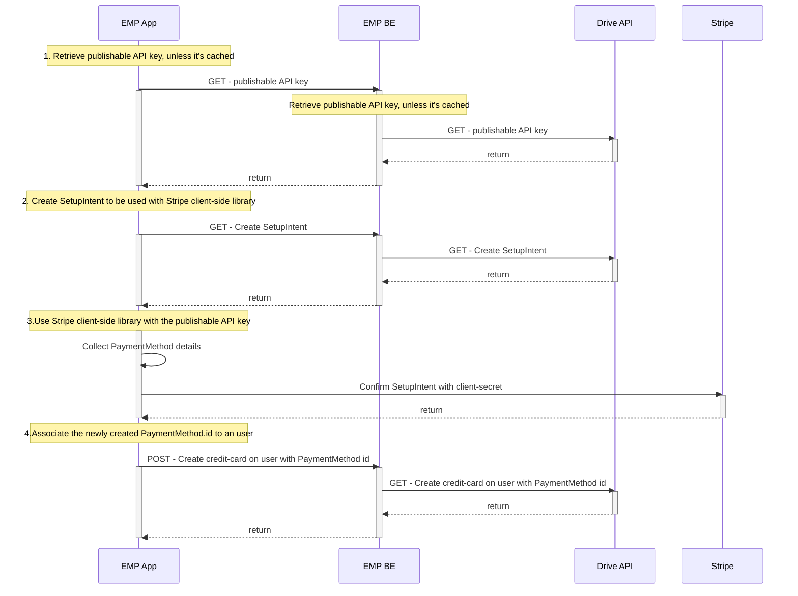

Playing around with Mermaid diagrams :stuck_out_tongue:

This is a test string to be edited!

<HTMLBlock>{`
<html>
  <head>
    
  </head>
</html>
`}</HTMLBlock>

 

# TEST

 

Another sentence appear!

<HTMLBlock>{`

`}</HTMLBlock>

<HTMLBlock>{`
<html>
  <head>
    
  </head>
  <body>
    <h1>This is a test heading</h1>
    
If dark mode is enabled, this heading should turn red.

  </body>
</html>
`}</HTMLBlock>